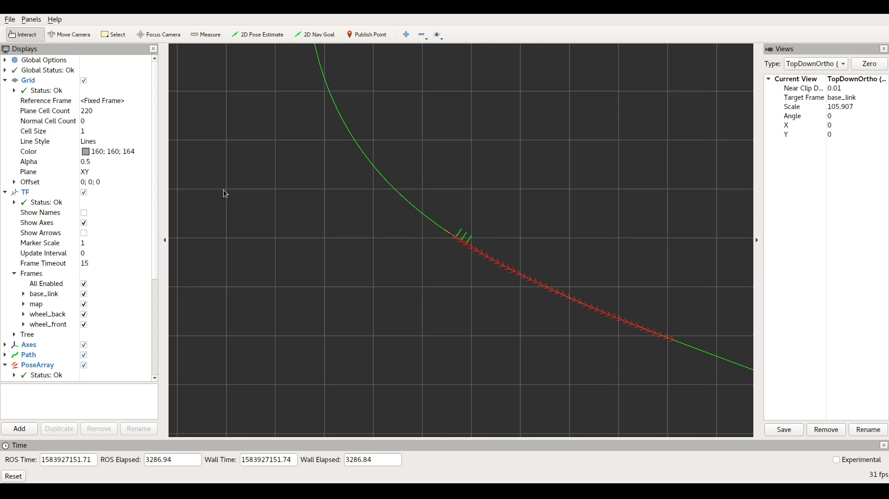
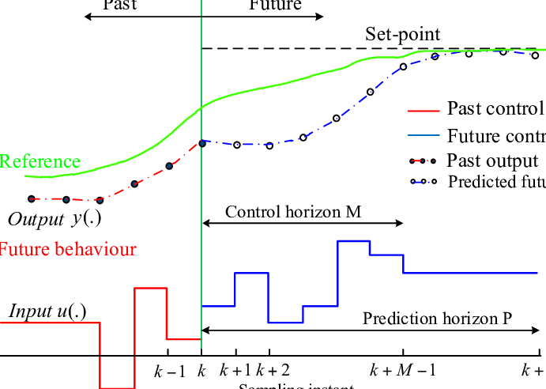
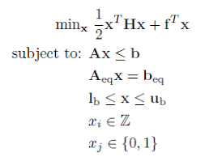

# 自动驾驶车辆模型预测控制算法

## Demo及摘要

点击下面播放视频Demo：

[](img/demo.mp4)

坐标轴为车辆中心，红色箭头为预测车辆运行轨迹，蓝色箭头为规划目标轨迹，绿色曲线为车道中心。

## 研究内容

业界自动驾驶车辆的控制（Control）大多数使用模型预测控制（MPC）算法，即接受行驶轨迹，控制方向盘，油门及刹车，使得车辆跟随轨迹行驶（Lane Following）。

本项目基于ROS框架开发，实现了模型预测控制（MPC）算法，以及一个实时仿真环境。可以实现在仿真环境中稳定地控制自动驾驶车辆跟随目标轨迹的功能。

## 应用

本项目是一个通用的模型预测控制（MPC）控制算法，并且实现了标准的ROS接口，可以直接通过ROS通讯框架对接硬件，只需稍加修改，即可实现自动驾驶车辆，机器人，无人机等系统的控制部分。

# 编译方法

## Step 1
1. 本项目在```Ubuntu 18.04 LTS```系统下编译及测试，推荐使用该系统作为运行环境。
2. 安装```ROS Melodic```版本，**此步骤较为繁琐**，请参考ROS Wiki完成安装，具体操作方式详见[ROS Wiki: Installation](http://wiki.ros.org/melodic/Installation)，需要desktop-full安装，在此不在赘述。
3. 安装```ecl_geometry```包

```bash
sudo apt install ros-melodic-ecl-geometry
```

## Step 2
下载并构建OSQP

请在本项目根目录输入如下指令

```bash
git clone --recursive https://github.com/oxfordcontrol/osqp
cd osqp
mkdir build
cd build
cmake -G "Unix Makefiles" ..
cmake --build .
```

如果此步骤出现问题，请参考[OSQP 官方文档](https://osqp.org/docs/get_started/sources.html)

## Step 3
编译本项目

请将本项目放置于ROS工作区中，项目文件夹名字为```car_model```，关于如何建立ROS工作区请参考[ROS Wiki: Create a Workspace](http://wiki.ros.org/catkin/Tutorials/create_a_workspace)，并且在ROS工作区目录输入如下指令

```bash
catkin_make
```

至此，大功告成！

# 使用及测试

打开终端输入

```bash
roslaunch car_model sim.launch
```

即启动控制器和模拟器，并且显示RViz可视化界面。

可视化界面中，坐标轴为车辆中心，红色箭头为预测车辆运行轨迹，蓝色箭头为规划目标轨迹，绿色曲线为车道中心。

可以看到车辆很稳定地跟随车道

如果想控制硬件系统，需要启动对应系统的姿态估计程序，并且发布对应的 ```car_state``` 消息来确定系统状态，然后接收 ```geometry_twist``` 消息作为硬件控制指令，参考 ```tracks/racetrack01.txt``` 编写轨迹文件，然后启动控制器

```bash
rosrun car_model controller_mpc track_filename:=<轨迹文件名> track_scale:=1.0
```

# 文件结构

- include ... 头文件
    - controller_mpc -- MPC控制器头文件
        - mpc.h -- MPC控制器
        - path_planner.h -- 轨迹规划程序
        - quintic_solver.h -- 五次方程数值求解，使用Descartes Rule of Signs及二分法

    - simulator -- 模拟器
        - simulator.h -- 模拟器
        - vec2.h -- 二维向量库

- src
    - controller_mpc -- MPC控制器
        - controller_mpc.cpp -- MPC控制器 ROS 接口部分
        - mpc.cpp -- MPC控制器 主体实现
        - path_planner.cpp -- 轨迹规划程序

    - simulator -- 模拟器
        - main.cpp -- 主程序
        - simulator.cpp -- 模拟器算法及车辆仿真模型

- tracks
    > 车道轨迹，每行两个数x,y，表示路径点坐标，程序会自动插值成三次样条。

- launch
    > roslaunch 启动文件

- msg
    > ROS 消息定义

- osqp
    > OSQP 二次规划求解器

# 算法

## 模型预测控制



MPC 通过模型预测未来的系统状态，转化为QP问题，求出最优的控制方案

## 车辆物理模型


*参考文献: 物理模型部分 - Car Model*

## 二次规划

二次规划解决这样一个优化问题



这里使用的是OSQP求解器

## 模拟器

模拟器通过ROS框架与控制器实时交互，根据车辆动力学数值求解微分方程进行仿真，动力学模型在车辆物理模型部分有详细描述。

数值求解微分方程使用前向欧拉法 (Forward Euler method)

# 验证

软件验证采用单元测试，蒙特卡洛测试和综合测试相结合的方式，遵循从部分到整体的严谨测试方式。

## 单元测试和蒙特卡洛测试

轨迹规划和MPC部分采用单元测试+蒙特卡洛测试的方式。

单元测试通过不同等价类的数据测试算法正确性。

蒙特卡洛测试通过生成大量随机数据测试算法正确性，运行效率与稳定性。

轨迹规划了蒙特卡洛测试的方式，加载固定轨迹，并且随机取点测试规划正确性及效率。

QP部分采用了几个等价类的sample进行测试。

运行测试方式：

```bash
rosrun car_model tests
```

## 单元测试结果

全部通过

## 综合测试

综合测试控制器性能需要通过观察预测轨迹和Cross-Track-Error，预测轨迹越接近实际轨迹，则物理模型性能越好。Cross-Track-Error，即车辆偏离车道中心的距离，是量化指标，越低表示控制器性能越好。

通过在模拟环境运行控制器
```bash
roslaunch car_model sim.launch
```

若红色轨迹与实际轨迹偏差较大，即**车辆物理模型**存在问题

若蓝色轨迹与绿色目标轨迹偏差较大，即**车辆物理模型**存在问题

若控制器性能较差，即**控制器**或者**控制器参数**存在问题

## 综合测试结果

控制器稳定运行，各轨迹均不存在较大偏差，测试通过。

# 参考文献

*链接均有效，如无法打开，请检查网络连接*

**物理模型部分**
1. [Robust Model Predictive Control for Autonomous Vehicle/Self-Driving Cars](https://arxiv.org/pdf/1805.08551.pdf)
2. [Car Model](https://github.com/MPC-Berkeley/barc/wiki/Car-Model)
3. [PythonRobotics](https://github.com/AtsushiSakai/PythonRobotics)

**控制算法**
1. [Lane keeping in autonomous driving with Model Predictive Control & PID](https://medium.com/@jonathan_hui/lane-keeping-in-autonomous-driving-with-model-predictive-control-50f06e989bc9)

**QP solver**
1. [OSQP solver documentation](https://osqp.org/docs/index.html)

**ROS 框架**
1. [ROS Wiki](http://wiki.ros.org/)